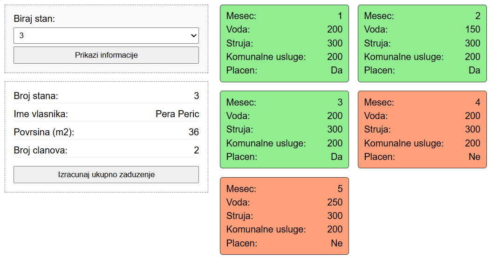

# Building Expenses Tracker (Evidencija Troškova Zgrade)

A web application for managing apartment bills and calculating total debts. The system allows the building manager to view information for each apartment, track paid/unpaid bills, and calculate total debt in real-time.

## Key Features (Glavne Funkcionalnosti)

This project demonstrates how to connect a .NET backend with a JavaScript frontend to handle financial data.

### 1. Dynamic Debt Calculation (Računanje Dugovanja)
The application does not just list bills; it performs calculations on demand.
* **Backend Logic:** The `IzracunajUkupnoZaduzenje` API endpoint uses **LINQ** (`SumAsync`) to filter only unpaid bills and calculate the total sum directly in the database.
* **Frontend:** The calculation is triggered by a button click, fetching the result asynchronously without reloading the page.

### 2. Automatic Business Rules (Automatska Logika)
To prevent human error, some data is calculated automatically by the system:
* When a new bill is created, Electricity and Utility costs are **automatically calculated** based on the number of family members (e.g., `150 * FamilyMembers`), ensuring consistency.

### 3. Visual Status Indicators
The UI provides immediate visual feedback to the user:
* **Green Cards:** Indicate paid bills (`Placen: Da`).
* **Red Cards:** Indicate unpaid bills (`Placen: Ne`).
* This is achieved through **conditional CSS classes** applied via JavaScript based on the data received from the API.

## Tech Stack

* **Backend:** C# .NET 8.0, Entity Framework Core
* **Database:** SQL Server
* **Frontend:** Vanilla JavaScript (ES6), HTML5, CSS3
* **Communication:** Fetch API, CORS enabled for secure client-server communication.

## How It Works

1.  **Select Apartment:** The user selects an apartment number from a dropdown menu populated from the database.
2.  **View Details:** The app fetches owner details and a list of all bills using `GET` requests.
3.  **Calculate Debt:** By clicking "Izracunaj ukupno zaduzenje", the app sends a request to the server to sum up all unpaid costs for that specific apartment.